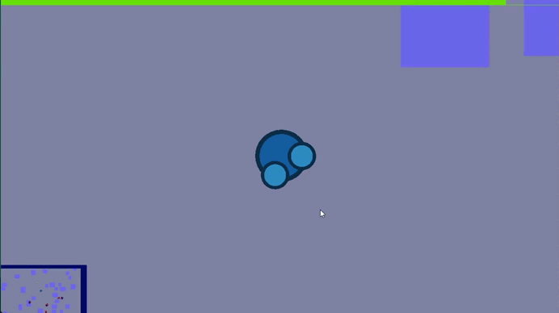

# Run And Gun

3rd year 1st assignament for the Computer Graphics course.



## How-To-Build

To generate a Windows solution or a Makefile use the provided CMakeLists.txt
```bash
    cmake -Bbuild
```

## How-To-Play

WASD for movement

Left Mouse Button to shoot


## TODOs

- [x] Custom Rendering func
- [x] Basic User Input
- [x] Direction change via mouse input
- [x] AABB-Circle collision detection
- [x] Camera on player
- [x] GUNS! GUNS! GUNS!
- [x] Score in terminal
- [x] Enemy classes (and their AI)
- [x] Healthbars
- [x] Pickups
- [x] Minimap
